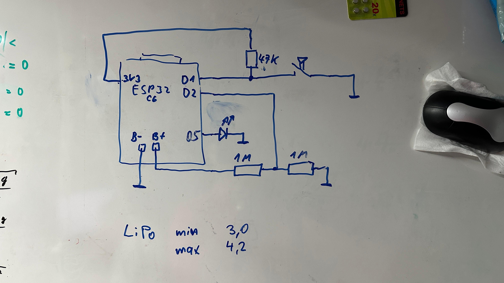
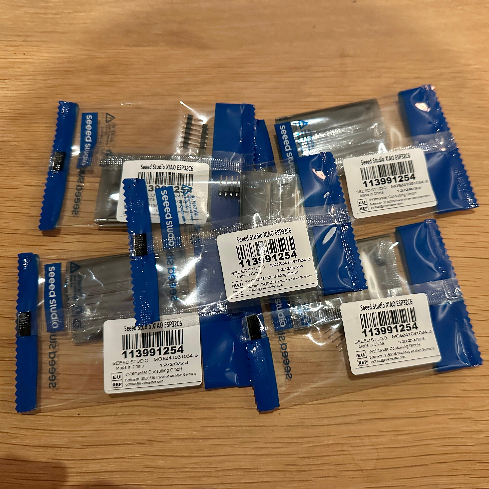
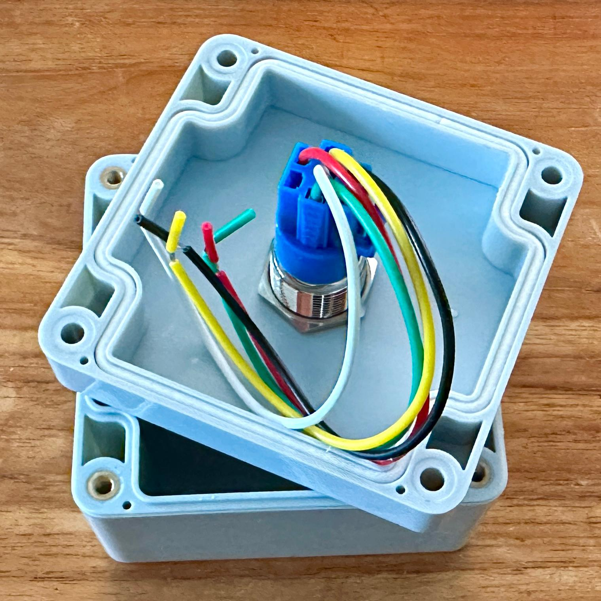
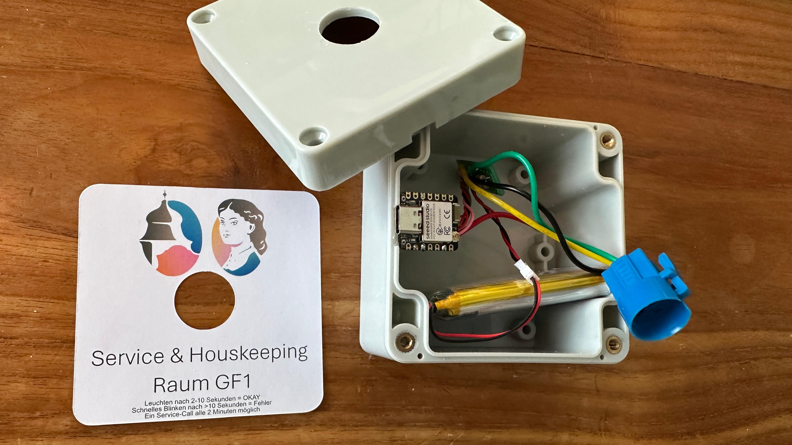
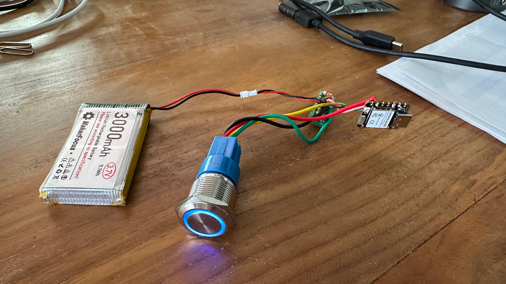
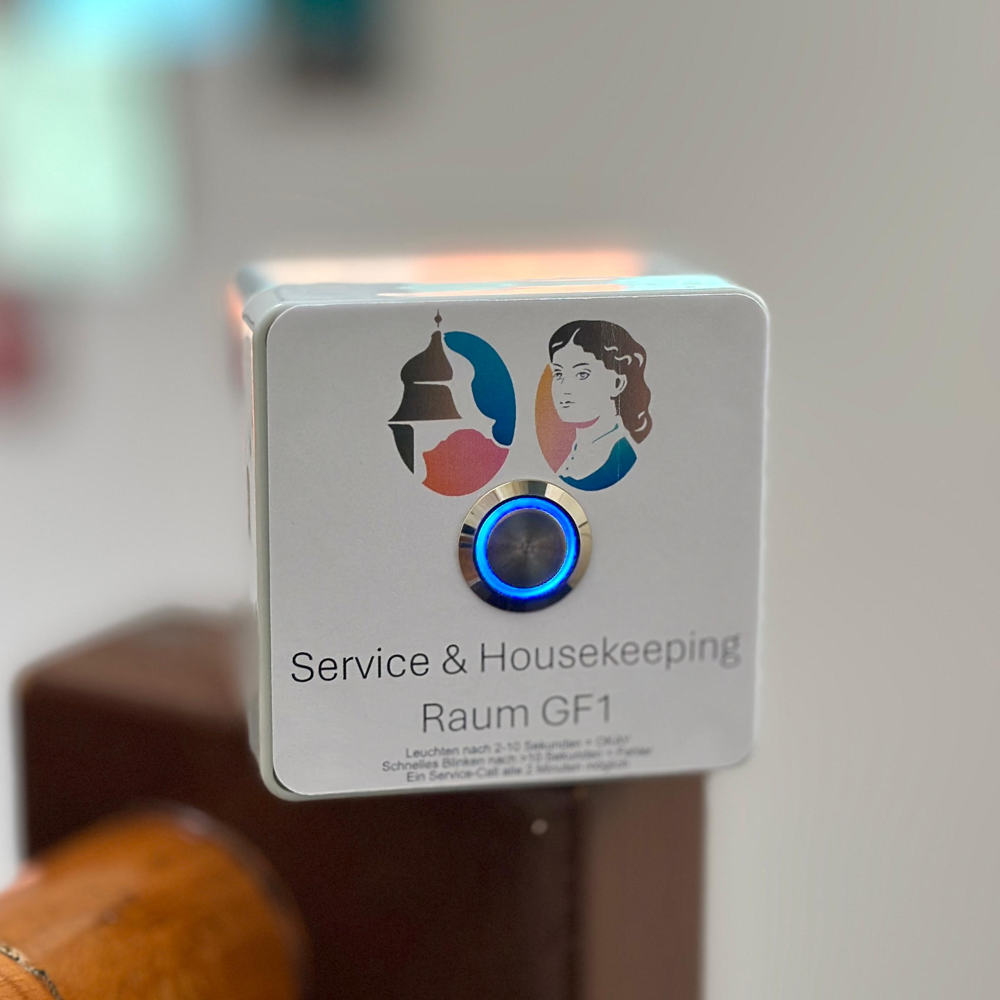

# GF1 Buzzer Bauplänschär

## Materialliste

- Drucktaster Chrom
	- https://funduinoshop.com/bauelemente/taster-und-schalter/taster/drucktaster-chrom-3v/5v-led-beleuchtet-mit-fassung?number=F23110281.4

- Runde Abstandshalter
	- https://amzn.eu/d/hBxPcc0

- 3,7V 3000mAh Lithium Batterie 1S 1C LiPo Akku
	- https://amzn.eu/d/ddtFzXY

- Seeed Xiao ESP32-C6
	- https://botland.de/wifi-und-bt-module-esp32/24783-seeed-xiao-esp32-c6-wifi-bluetooth-seeedstudio-113991254-5904422385705.html

- Anschlusskästen DIY Kunststoff
	- https://amzn.eu/d/bSC8Pgd

- Leiterplatte Universal
	- https://amzn.eu/d/5xbwfc5

- Widerstände
	- https://amzn.eu/d/5lTMLQv

# Schaltplänschär

# Gallerie

## Materiallieferung

## Vorbereitung

## Positionierung

## Funktionstest

# FINALLY...!

## Erstauslieferung

